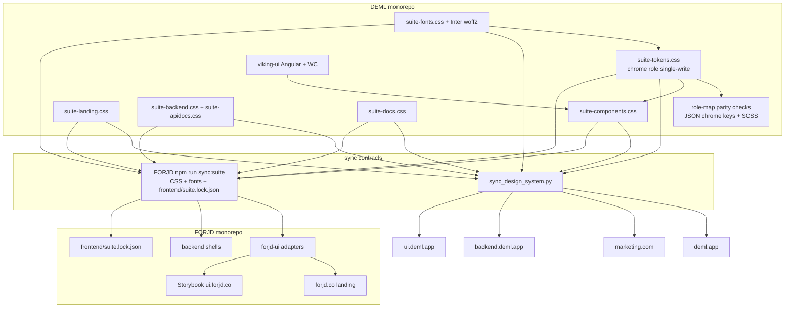
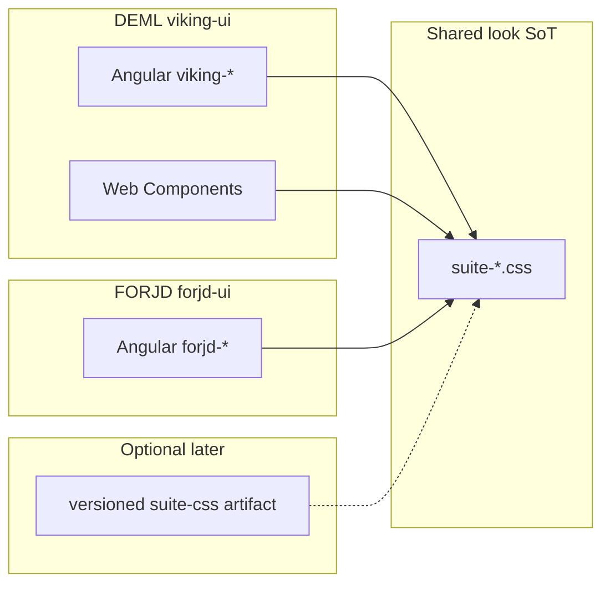
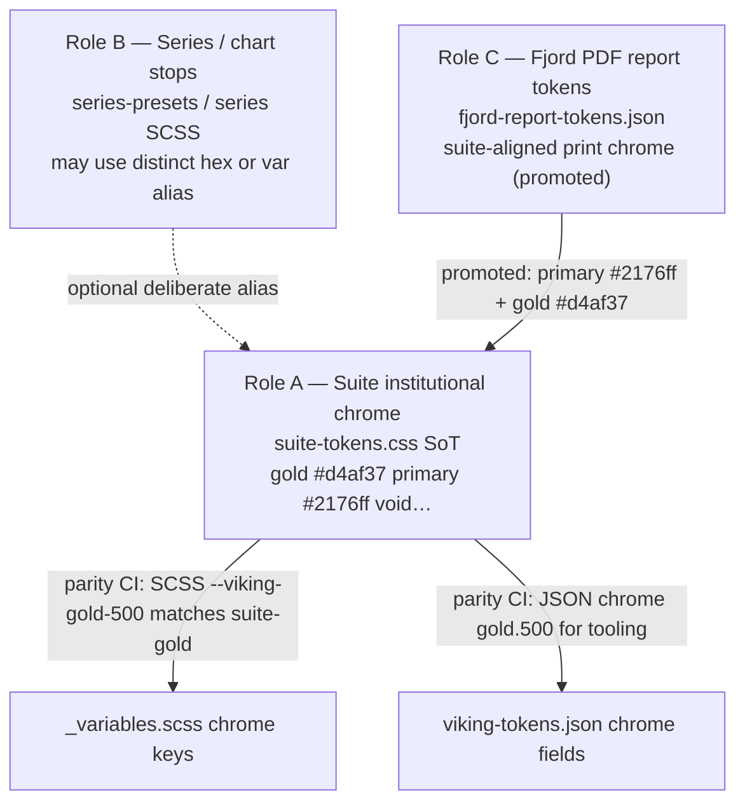
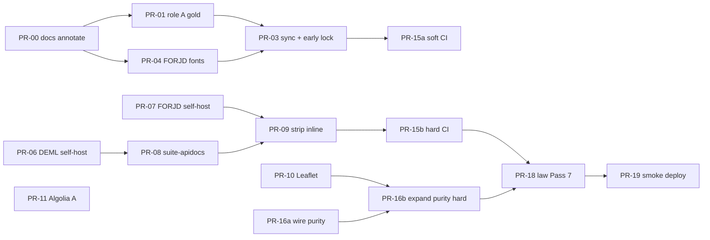

# Suite Visual Identity Completion — Enforcement Design

| Field | Value |
| ----- | ----- |
| **Title** | UNIFICATION MANDATE Completion: Multi-Repo Visual Identity as Law |
| **Author** | Grok Design (suite unification completion) |
| **Date** | 2026-07-25 |
| **Status** | Draft (revision 3 — re-review polish: smoke script + lock path) |
| **Supersedes (operationally)** | Passes 1–6 "done" claims where exploration finds residual divergence; Pass 6 = foundation complete, **not** identity complete |
| **Canonical SoT** | DEML `packages/viking-ui` (`@dataengineeringformachinelearning/viking-ui@9.7.3`) |
| **Related law** | DEML `docs/SUITE_UI_UNIFICATION.md`, FORJD `docs/SUITE_UI_UNIFICATION.md`, `THEME.md` |

---

## Overview

Passes 1–6 established the suite design system: canonical `--suite-*` tokens, owned chrome CSS (`suite-components` / `suite-landing` / `suite-backend` / `suite-docs`), forjd-ui adapters, and a DEML **local** purity script (`npm run suite:purity`). Those passes are **necessary but not sufficient**. Exploration on 2026-07-25 shows residual purity holes, token role/artifact confusion, incomplete font delivery on FORJD backend shells, dual docs surfaces, and an incomplete enforcement story: **`suite:purity` is not wired into either repo’s PR CI today** (DEML PR gates run `enforce-theme.js` only).

This document is the **completion and enforcement design** (Pass 7). It does not re-litigate the locked palette or restate greenfield Pass 1–6 work. It:

1. Audits what is actually identical today vs still divergent.
2. Decides dual Angular adapters + CSS SoT (no shared Angular package); CSS may later publish as a versioned artifact without changing that model.
3. Closes purity holes that affect **live host chrome** (API docs, Leaflet, Algolia, fonts).
4. Clarifies token roles (suite institutional gold vs series palette vs PDF report tokens) and space-alias policy.
5. Defines adapter parity language honestly (adapter existence ≠ visual sign-off); per-host acceptance; CI that fails only after holes are closed (soft → hard).
6. An ordered PR plan with multi-repo merge protocol and a **critical path** for “identity complete.”

**Target outcome:** A user cannot distinguish which product surface they are on by chrome, buttons, cards, type, density, or motion. Product names and logos may differ; the design system must not.

**Interim law status:** Pass 6 = foundation complete (suite CSS + adapters + local purity script). Residual holes G1–G12 are **Pass 7**. Early docs annotation (PR-00) must land so AGENTS / SUITE_UI_UNIFICATION do not claim purity complete while CDN docs and font holes remain.

---

## Background & Motivation

### Current state (strong foundation)

| Layer | DEML path | FORJD path | State |
| ----- | --------- | ---------- | ----- |
| Tokens | `packages/viking-ui/src/tokens/suite-tokens.css` | Vendored via `npm run sync:suite` → `frontend/libs/forjd-ui/src/lib/styles/` + `backend/static/` | Lockstep **only when sync is run** |
| Chrome CSS | `suite-components.css`, `suite-landing.css`, `suite-backend.css`, `suite-docs.css` | Same vendor set (forjd-ui styles + backend static for subset) | Strong when synced |
| Fonts | Inter via bundled `viking-ui.css` + `backend/static/fonts/inter` (relative `fonts/inter/`) | Frontend angular.json loads `suite-fonts.css`; backend has CSS file but **does not link it**; no `/fonts` mount; sync does not copy font binaries to backend | Partial |
| Angular product | deml.app nearly composition-only; `viking-app.css` | forjd.co **landing-only** composition | Strong for live chrome |
| Adapter library | `@dataengineeringformachinelearning/viking-ui@9.7.3` (~100+ lib modules) | `forjd-ui@0.1.0` ~23 public adapters + `.suite-*` classes | Core primitives for Storybook; unused gaps do not affect live hosts today |
| Purity **script** | `npm run suite:purity` → `scripts/check-suite-purity.mjs` | No native gate; sibling compare only if DEML checkout present | Script exists DEML-only |
| Purity **CI** | **Not wired.** `viking-ui-pr-gates.yml` runs `node scripts/enforce-theme.js` only — not `suite:purity`. `quality-gates.yml` / `ci-tests.yml` do not invoke it | `frontend-ci.yml` = test + build only | **Neither repo CI-fails on suite purity today** |
| Visual regression | Chromatic runs with **`--exit-zero-on-changes`** (does not block merge) | Local `chromatic` script + `exitZeroOnChanges: true`; **no** `.github/workflows` Chromatic job | Publishes diffs; **not** a merge gate |

### What `suite:purity` actually checks today

`scripts/check-suite-purity.mjs` (Pass 6 foundation):

- Retired cyan `#00b4ff`, Google Fonts CDN strings
- Forbidden style packages (Material, Bootstrap, Primeng, Tailwind, etc.)
- viking-ui zero runtime `dependencies`
- Optional sibling FORJD: SHA lockstep of five suite CSS files under forjd-ui styles; leftover `_typography.scss` / `status-list.scss` bans

It does **not** (yet) check: institutional gold / JSON role map, jsDelivr swagger/redoc, Leaflet global CSS, suite-fonts link, backend/static vs forjd-ui styles parity, or font file hashes.

### Pain points (why completion is required)

1. **“Done” ≠ identical.** Pass 6 docs mark purity complete while CDN Swagger/ReDoc, Leaflet CSS, and FORJD backend fonts still diverge.
2. **Token role confusion.** Suite institutional gold `#d4af37` vs JSON/series `#c4a035` vs PDF report tokens (out of product UI scope unless promoted). Blind “all gold strings equal” is wrong.
3. **Host-level holes.** FORJD backend shells omit fonts; DEML backend gets Inter via bundle, not necessarily `suite-fonts.css`.
4. **Enforcement gap is absolute, not merely asymmetric.** Neither repo fails CI on purity; Chromatic does not block merge.
5. **Adapter backlog is not live identity.** Missing forjd-ui spinners/tooltips do not change any of the seven hosts’ chrome today (FORJD product is landing-only).

### Locked aesthetic (do not re-open)

Elevate existing hexes only — void black, electric `#2176ff`, institutional gold `#d4af37` for **product chrome**, danger/success/warning suite values. Inspirations are directional quality bars, not new palettes. External UI systems are pattern references only — zero runtime style packages for the look.

---

## Goals & Non-Goals

### Goals

1. **Visual identity law enforced** across all seven hosts:
   - forjd.co, backend.forjd.co, ui.forjd.co
   - deml.app, backend.deml.app, ui.deml.app
   - dataengineeringformachinelearning.com
2. **100% owned styles** for product chrome — no third-party visual look on suite surfaces (or fully isolated + overridden where a vendor widget is unavoidable).
3. **Token role map + suite single-write for chrome** — suite institutional tokens have one write path; series and PDF report roles are explicit; no silent cross-role overwrites.
4. **Tier-1 shared chrome adapters** exist **or are explicitly deferred** with suite class parity documented; Tier-2 remains DEML-only. “Parity” means adapter + suite class mapping + Storybook story — not export-for-export with viking-ui and not automatic visual sign-off.
5. **Per-host acceptance criteria** + Chromatic **diff publication** (human review of changes). Optional later: hard Chromatic status checks (requires config + secrets change — not assumed).
6. **CI that fails** on purity holes, sync drift, forbidden deps, and chrome-token role mismatches — **after** soft enablement and hole closures (see PR plan soft→hard).
7. **Incremental, mergeable PRs** with multi-repo protocol and a short critical path for “identity complete.”

### Non-Goals

- Inventing new primary brand colors or a third design system.
- Unifying product **content**, logos, or DEML-only chart/telemetry depth into FORJD.
- Shipping unused forjd-ui adapters (spinner, pagination, dropdown, …) as Pass 7 blockers when no FORJD product route consumes them.
- Rewriting OpenAPI tooling from scratch unless self-host + full skin proves insufficient (Phase B optional).
- Forcing light theme on all hosts (dark-first; light opt-in where already fully tokenized).
- Migrating FORJD onto an npm-installed viking-ui **Angular** package.
- Pixel-identical Storybook manager chrome beyond suite-docs.
- Claiming Chromatic or `suite:purity` already block merge — they do not until wired.

---

## Audit: Current Identity vs Mandate

### Identity matrix (2026-07-25)

| Dimension | deml.app | forjd.co | marketing.com | backend.deml | backend.forjd | ui.deml | ui.forjd |
| --------- | -------- | -------- | ------------- | ------------ | ------------- | ------- | -------- |
| Void `#0a0a0a` surfaces | Yes | Yes | Yes | Yes | Yes | Yes | Yes |
| Electric primary `#2176ff` | Yes | Yes (local) | Yes | Yes | Yes (local; deploy lag possible) | Yes | Yes |
| Suite tokens loaded | Yes | Yes | Via viking-ui.css | Yes | Yes | Yes | Yes |
| Suite components chrome | Yes | Yes | Bundle | Folded | Yes | Yes | Yes |
| Self-hosted Inter | Yes | Yes | Yes | Via `viking-ui.css` + static fonts (not necessarily suite-fonts.css) | **Gap: suite-fonts not linked; no `/fonts` mount; system fallback** | Yes | Yes |
| Stock Swagger/ReDoc CDN | n/a | n/a | n/a | **Yes (jsDelivr)** | **Yes (jsDelivr)** | n/a | n/a |
| Leaflet third-party CSS | **Yes (angular.json global)** | n/a | n/a | n/a | n/a | n/a | n/a |
| Algolia Experiences chrome | Possible inject | n/a | Possible inject | n/a | n/a | n/a | n/a |
| Composition-only app SCSS | Near zero | Landing yes | Own law via package | Templates | Python HTML shells | Stories | Stories |
| page-template / layout grade | B (login/auth/success shells diverge) | Landing only | Landing DNA | Splash + docs topbar | Splash + docs topbar | Taxonomy ok | Taxonomy ok |

### Remaining gaps (severity)

| ID | Gap | Severity | Identity-complete blocker? | Evidence |
| -- | --- | -------- | -------------------------- | -------- |
| G1 | Swagger-UI + ReDoc from jsDelivr; stock chrome partially overridden; FORJD large inline CSS vs DEML SCSS may diverge (colored methods vs quiet chips) | **High** | **Yes** | FORJD `docs_page.py` / `redoc_page.py`; DEML `swagger.html` / `redoc.html`; `swagger-ui.scss` |
| G2 | Leaflet CSS global in deml.app | **Medium** | **Yes** (deml.app chrome leak) | `frontend/angular.json` |
| G3 | Algolia Experiences third-party chrome | **Medium** | **Yes** (deml/marketing) | `algolia-search.js` |
| G4 | FORJD backend fonts not delivered | **High** | **Yes** | shells omit suite-fonts; no `/fonts`; sync skips backend binaries |
| G5 | Token role drift: suite institutional gold `#d4af37` vs JSON/series `#c4a035`; PDF report tokens separate | **High** (chrome) / **scoped** (series/PDF) | **Yes for chrome role** | `viking-tokens.json`, `fjord-report-tokens.json`, suite-tokens, `_variables.scss`; `enforce-theme.js` allowlists both hexes |
| G6 | `--fj-space-*` non-isomorphic; product consumers essentially none; report uses undefined `--fj-space-20/24` | **Low–Medium** | **No** for product UI; fix in report workstream | suite-tokens aliases; `fjord-report-tokens.json` `plotHeight` |
| G7 | DEML layout grade B (auth shells) | **Medium** | **No** for cross-product chrome law; **Yes** for deml.app polish | login/success routes |
| G8 | Dual docs Storybook + viking-ui-docs | **Low–Medium** | **No** | taxonomy risk only |
| G9 | Light theme partial support | **Low** | **No** (policy) | dark-lock vs deml light |
| G10 | Production deploy lag | **Ops** | **Yes** until smoke | live hosts |
| G11 | forjd-ui ≪ viking inventory | **Low for identity** | **No** (backlog when FORJD product UI needs) | ~23 vs ~100+ |
| G12 | Purity not in CI either repo; Chromatic non-blocking | **High** | **Yes** (enforcement) | workflows as above |
| G13 | THEME.md / docs still show series example `#c4a035` while code may use `var(--viking-gold-500)` | **Nit** | **No** | doc hygiene |
| G14 | Purity SHA set incomplete (no backend/static, no fonts binary hashes) | **Medium** | **Yes** for enforcement quality | `check-suite-purity.mjs` five files only |

### What is already strong (do not regress)

- suite-tokens / suite-components / suite-landing / suite-backend / suite-docs CSS ownership model.
- deml.app nearly zero local SCSS; composition-first product pages.
- forjd.co landing composition-only.
- Self-hosted Inter on product frontends; no Material/Bootstrap/Spartan runtime.
- forjd-ui adapters for core controls used in Storybook (`forjd-button` → `.suite-btn`, etc.).
- Dual selectors `.suite-*` / `.viking-*` / `.fj-*`.
- Local DEML purity script + enforce-theme dry-run in PR gates (partial coverage only).

---

## Key Decisions

| # | Decision | Rationale |
| - | -------- | --------- |
| **KD1** | **No shared Angular component package.** viking-ui is CSS/visual + DEML Angular SoT; forjd-ui remains a thin Angular adapter that vendors suite CSS via `sync:suite` (or a future **CSS-only** published artifact). Dual adapters are the model; “forever” applies to **not merging Angular libraries**, not forbidding a versioned suite CSS package later. | Avoids Angular peer hell and DEML product-depth coupling; matches existing law. CSS package is a distribution improvement, not a design-system fork. |
| **KD2** | **CSS is the shared product; TypeScript components are adapters.** | Headless behavior + owned classes. |
| **KD3** | **API docs Phase A:** self-host swagger-ui + redoc **behavior** assets + owned suite skin. Phase B custom explorer only if residual stock chrome remains. | Cost/risk split; CDN is purity + CSP liability for apidocs. |
| **KD4** | **Three token artifact roles** (do not collapse): (a) **suite institutional chrome** — gold `#d4af37`, primary `#2176ff`, void surfaces — single-write in `suite-tokens.css`, SCSS parity for matching keys; (b) **series / chart palette stops** — may keep distinct hexes or alias deliberately to suite tokens; not auto-rewritten by “all gold = d4af37”; (c) **fjord PDF report tokens** — labeled out of product UI scope unless explicitly promoted; may retain report-specific blues/golds until a product decision. CI tests the **role map**, not global string equality for every “gold.” | Prevents breaking charts/PDF while fixing product chrome drift. `enforce-theme.js` today allowlists both golds inconsistently with hard equality. |
| **KD5** | **Space aliases short-term: freeze map (option b) + ban new `--fj-space-*` in product.** Document current collapsed map. Fix `fjord-report-tokens.json` `plotHeight` (`--fj-space-20/24` undefined) in report workstream. Optional later isomorphic flip only if product consumers appear (grep shows none beyond definitions today). | Product risk of isomorphic flip is low; marketing it as high risk was wrong. Dead/undefined report aliases are the real bug. |
| **KD6** | **Fonts outcome = Inter loads successfully.** FORJD backend: link `suite-fonts.css` + mount `/fonts` + sync binaries (Option A). DEML backend: accept current bundle path if `document.fonts` / network shows Inter; do **not** require the string `suite-fonts.css` if Inter is already delivered via `viking-ui.css`. | Outcome-based acceptance avoids false fails on healthy DEML. |
| **KD7** | **Leaflet isolation default: build-time scoped CSS under `.suite-map` via `@layer map-vendor` (or nested `.suite-map { … }` import).** Avoid Shadow DOM unless map host becomes an isolated WC. Spike criteria: pan/zoom, markers, attribution, popup, dark void page no global Leaflet body bleed. | Naive Shadow DOM often breaks Leaflet measurement. |
| **KD8** | **Algolia Phase A = CSS neutralization + purity ban on new Algolia CSS imports.** Experiences DOM may still inject. Phase B = data-only render via suite list/palette. Do not claim full Experiences removal this pass. | Research inventory is not a design; Phase A is implementable. |
| **KD9** | **Dark-first; light opt-in only where fully tokenized.** | Avoid half-broken light. |
| **KD10** | **Storybook is component contract surface; viking-ui-docs is secondary consumer.** Chromatic **publishes** diffs for human review (current flags). Hard merge-blocking Chromatic is a **separate opt-in** (PR-17b), not assumed for Pass 7 identity complete. | Match real `exitZeroOnChanges` / `--exit-zero-on-changes` behavior. |
| **KD11** | **Tier-1 = shared chrome used or required for suite Storybook Foundation on both UIs.** Missing adapters (spinner, tooltip, pagination, …) are **backlog when FORJD product UI needs them**, not Pass 7 blockers. Tier-2 DEML-only. | FORJD app is landing-only; unused adapters do not change live identity. |
| **KD12** | **Enforcement CI soft → hard.** Wire existing purity script first (may still be green on foundation checks only); expand checks only after hole PRs merge. FORJD `frontend/suite.lock.json` early so CI works without DEML sibling. | Avoid red main from enabling expanded gates before fixes. |
| **KD13** | **API docs visual contract = quiet suite method chips** (DEML `swagger-theme-contract` / raised surfaces), not multicolored HTTP method rainbow. FORJD inline overrides that color GET/POST/etc. differently must converge to quiet chips when consolidating skins. | One suite look; DEML contract already encodes quiet chips. |
| **KD14** | **CSP tightening is staged per host and feature.** Self-hosting swagger does not remove `cdn.jsdelivr.net` while Algolia Experiences still loads from jsDelivr on deml/marketing. Never claim global jsDelivr removal until Algolia decision lands. | Avoid broken search CSP. |

---

## Proposed Design

### Architecture (completion target)



### Load order (law)

#### Product / landing / Storybook surfaces

1. `suite-fonts.css` (or equivalent Inter delivery already in bundle — outcome: Inter)
2. `suite-tokens.css`
3. `suite-components.css`
4. Surface stage: `suite-landing.css` | `suite-backend.css` | `suite-docs.css` | app bundle
5. App composition CSS only if strictly non-chrome (trend to zero)

#### API docs shells (canonical cascade)

**Vendor base first, suite chrome and overrides last** (matches cascade needs and supersedes any conflicting earlier snippet):

1. `suite-fonts.css` (FORJD) **or** Inter already available (DEML bundle)
2. `suite-tokens.css`
3. `suite-components.css`
4. `suite-backend.css` (topbar / splash shell)
5. **Vendor** `swagger-ui.css` or redoc base styles (self-hosted)
6. **`suite-apidocs.css`** (owned overrides — always after vendor)
7. Vendor JS last

```html
<!-- Canonical FORJD /docs head order -->
<link rel="stylesheet" href="/static/suite-fonts.css" />
<link rel="stylesheet" href="/static/suite-tokens.css" />
<link rel="stylesheet" href="/static/suite-components.css" />
<link rel="stylesheet" href="/static/suite-backend.css" />
<link rel="stylesheet" href="/static/vendor/swagger-ui.css" />
<link rel="stylesheet" href="/static/suite-apidocs.css" />
```

**Contract tests:** Replace “vendor before viking-ui.css” with:

- Vendor swagger CSS is present and self-hosted (no `cdn.jsdelivr.net` for swagger/redoc).
- `suite-apidocs.css` (or suite override bundle) appears **after** vendor swagger CSS.
- Quiet method-chip rules remain as in DEML swagger contract intent.

### Library model (KD1)



**Rule:** New shared chrome lands in suite CSS first, then Viking component if DEML needs it, then forjd-ui adapter only when FORJD product or Tier-1 Storybook Foundation requires it. Never app-local chrome.

### Close purity holes

#### P1 — Owned API docs chrome (G1)

**Phase A (required for identity complete):**

| Action | DEML | FORJD |
| ------ | ---- | ----- |
| Vendor pin | Copy `swagger-ui-dist@5` CSS/JS and `redoc@2` standalone into `backend/static/vendor/` | Same |
| Templates | Drop jsDelivr for swagger/redoc; local assets | Same in `docs_page.py` / `redoc_page.py` |
| Skin unify | Expand `swagger-ui.scss` → `suite-apidocs.css` (or fold into suite-backend); **diff FORJD inline rules vs DEML SCSS first** | Remove large inline `<style>`; consume suite-apidocs only |
| Visual contract | **Quiet method chips** (KD13) — raised surfaces, not HTTP color rainbow | Converge FORJD colored methods to quiet chips |
| CSP | Remove jsDelivr from **docs HTML CSP only** where no longer needed for swagger/redoc; keep jsDelivr if other HTML shells still need it | Update `security.py` **and** `backend/tests/test_security_headers.py` (today **asserts** `cdn.jsdelivr.net` present — must co-change) |
| Contracts | Rewrite `swagger-theme-contract.test.mjs` for cascade + no CDN | Python tests: no CDN URLs; fonts outcome |

**Phase B (optional):** custom suite OpenAPI explorer if skin residual fails acceptance screenshots.

**Acceptance:** Inter, void, electric primary, suite topbar, quiet chips, authorize/try-it controls suite-aligned; no jsDelivr for swagger/redoc assets.

#### P2 — Leaflet isolation (G2)

**Default approach (chosen):**

1. Remove `"leaflet/dist/leaflet.css"` from `frontend/angular.json` global styles.
2. Add build step or SCSS:

```scss
// Conceptual — implement in viking-ui surfaces
@layer map-vendor {
  .suite-map {
    @import "leaflet/dist/leaflet.css"; // or postcss-prefixwrap equivalent
  }
}
```

Prefer **PostCSS prefixwrap / lightningcss nesting** of Leaflet rules under `.suite-map` if `@import` inside layer is fragile. Avoid Shadow DOM as default.

3. Analytics host: `<div class="suite-map viking-map">…</div>`.
4. Suite tokens for controls/popups/attribution.
5. **Spike acceptance (before purity hard-fail):** map tiles load; pan/zoom; marker; popup; no Leaflet styles on non-map pages (inspect body/button outside `.suite-map`).
6. Screenshot: analytics map section for Chromatic/Playwright fixture.
7. Purity hard-fail only after spike green: ban global leaflet.css in angular.json.

#### P3 — Algolia chrome policy (G3)

| Phase | Scope | Deliverable |
| ----- | ----- | ----------- |
| **A (identity)** | Keep Experiences JS if needed; suite CSS under `.algolia-autocomplete-host` / open states; neutralize default chrome (bg, border, type, primary) to `--suite-*` only | Checklist + screenshots search open; purity: fail on new Algolia CSS imports without host wrapper |
| **B (follow-up)** | Algolia HTTP API as data source; render with `viking-suite-search-palette` / suite list | Remove Experiences chrome dependency |

Do not invent a full Experiences DOM inventory in this design — Phase A is override-by-host with visual acceptance.

#### P4 — Fonts (G4)

**FORJD PR-04 checklist (all required):**

1. Link `/static/suite-fonts.css` first in `landing_page.py`, `docs_page.py`, `redoc_page.py`.
2. Mount `/fonts` → `backend/static/fonts` (or equivalent) so `@font-face` URLs `/fonts/inter/*` resolve.
3. Extend `sync-suite-from-viking.mjs` to copy Inter woff2 → `backend/static/fonts/inter` (in addition to `frontend/public/fonts/inter`).
4. Integration test: `GET /fonts/inter/InterVariable.woff2` → 200; HTML contains suite-fonts link.
5. Manual/staging: computed `font-family` includes Inter on splash and `/docs`.

**DEML PR-05 acceptance (outcome-based):**

- Inter file fetch succeeds under backend static path used by `viking-ui.css` (today `fonts/inter/` relative to CSS).
- Do **not** require `suite-fonts.css` string if Inter already loads via bundled CSS.
- Optional: document dual path (bundle vs suite-fonts) as allowed for DEML backend only.

### Token roles & single-write (G5, G6)

#### Role map



#### Concrete chrome fixes (Pass 7)

1. **Role A:** Ensure `viking-tokens.json` **chrome** gold field(s) used for product tooling equal `#d4af37`. If JSON `gold.500` is dual-used as series stop, **split keys** (e.g. `chrome.gold` vs `series.goldStop`) rather than overwriting series intent blindly.
2. **Role B:** Leave series stop `#c4a035` only if charts intentionally need a distinct stop; otherwise alias series gold to `var(--viking-gold-500)` / suite gold and document. Update THEME.md examples (G13).
3. **Role C (promoted 2026-07-26):** PDF report chrome aligns to suite primary `#2176ff` + institutional gold `#d4af37`. Brand artwork blue `#0078ff` stays logos/mark-only. `plotHeight` uses concrete px (no undefined `--fj-space-20/24`). Export PDFs are suite-styled reports with source titles/metadata — not CSV dumps in a PDF wrapper.
4. **enforce-theme.js:** Stop rewriting `#c4a035` → `var(--viking-gold-500)` without role context, or teach it role-aware allowlists so purity and enforce-theme agree.
5. **Space (KD5):** Freeze current `--fj-space-*` map in `SUITE_TOKENS.md`; ban new product usage of `--fj-space-*` (prefer `--suite-space-*`). Report `plotHeight` rewritten to `clamp(256px, 46cqi, 320px)`.

### Component API parity matrix

#### Definitions

| Term | Meaning |
| ---- | ------- |
| **Adapter parity** | Public forjd-ui export exists, maps to suite classes, has Storybook story under Foundation/Primitives |
| **Visual parity** | Chromatic (or screenshot) baseline reviewed — no unintended delta vs viking primitive |
| **Deferred** | Not required for Pass 7 identity complete; backlog when a FORJD route needs it |

#### Tier-1 — Shared suite chrome

| Suite chrome | viking-ui | forjd-ui | Status | Pass 7? |
| ------------ | --------- | -------- | ------ | ------- |
| Button | `viking-button` | `forjd-button` | Adapter parity | Verify visual via Storybook review |
| Input / Textarea / Select / Field | yes | yes | Adapter parity | same |
| Checkbox / Switch | yes | yes | Adapter parity | same |
| Card / Panel | yes | yes | Adapter parity | same |
| Badge / Callout | yes | yes | Adapter parity | same |
| Dialog / Sheet | yes | yes | Adapter parity (name delta OK) | same |
| Tabs / Table / Nav | yes | yes | Adapter parity | same |
| Toast / Skeleton / Empty | yes | yes | Adapter parity | same |
| Avatar / Separator | yes | yes | Adapter parity | same |
| Page shell / Section / Stack | page-template family | forjd-page-shell family | Partial adapter | Align stories only if Foundation shows gap |
| Spinner / Progress / Tooltip / Radio / Pagination / Breadcrumbs / Dropdown | yes | **Missing** | **Deferred backlog** | **No** — no FORJD product consumer |
| Theme toggle | yes | Missing | Deferred (dark-lock OK) | No |
| Site nav/footer | site-drakkar | product-specific | Brand OK | N/A |
| Command palette | yes | Missing | Deferred | No |

#### Tier-2 — DEML product depth (DEML-only)

Charts, metric-card, status-dashboard, explore-card, uptime-*, whitepaper-cta, kanban, editor, file-upload, property-filter, hud-panel, gauge-*, etc.

#### Parity contract tests (honest)

- Storybook taxonomy Foundation/Primitives on both UIs for **existing** adapters.
- Chromatic **publishes** diffs; reviewers approve intentional changes (non-blocking unless PR-17b).
- Do not claim export-for-export parity with viking-ui.

### Surface acceptance criteria

#### Shared checklist (every host — identity complete)

| Check | Criterion |
| ----- | --------- |
| Chrome | Suite topbar/nav/footer or backend topbar uses suite tokens only |
| Type | **Inter loads** (suite-fonts or equivalent bundle); not system-ui-only as primary |
| Color | Void bg, electric primary, institutional gold for chrome accents, no `#00b4ff` |
| Controls | Suite density (40px control, 8px radius, ≥44px touch mobile) |
| Motion | Tokenized durations; snappy |
| Density | 8px grid; container max-width per THEME where applicable |
| No stock vendor look | No CDN swagger/redoc; Leaflet scoped; Algolia host skinned (Phase A) |

#### Host-specific

| Host | Additional criteria |
| ---- | ------------------- |
| **forjd.co** | Landing composition-only; suite-landing DNA; logo electric |
| **deml.app** | Leaflet scoped; Algolia host skinned; auth polish optional (G7 non-blocking) |
| **marketing.com** | synced viking-ui.css; Algolia host skinned |
| **backend.forjd.co** | Inter 200 + suite-fonts linked; self-hosted apidocs; quiet chips; splash logo only |
| **backend.deml.app** | Inter via bundle or fonts; self-hosted apidocs; quiet chips |
| **ui.deml.app** / **ui.forjd.co** | suite-docs; Foundation/Primitives; Chromatic project builds (diff review) |

#### Visual regression (Chromatic) — honest gate

| Project | Stories | Gate today | Gate after PR-17 |
| ------- | ------- | ---------- | ---------------- |
| viking-ui | Foundation + primitives | Publishes; `--exit-zero-on-changes` | Still publish-by-default; optional 17b hard fail |
| forjd-ui | Same for existing adapters | No workflow | Add workflow with `exitZeroOnChanges: true` first; optional hard fail later |
| Docs shells | HTML fixtures / Playwright | Optional | curl/Playwright smoke in PR-19 |

### DEML layout consistency (G7) — non-blocking polish

Auth/success/not-found shell cleanup improves deml.app grade A but is **not** on the critical path for multi-host identity (chrome law already uses viking components). Track as parallel PR-14 optional.

---

## API / Interface Changes

### forjd-ui

**Pass 7:** no required new adapters for identity complete. When product needs them, follow:

```ts
// Pattern only — backlog
@Component({
  selector: 'forjd-spinner',
  template: `<span class="suite-spinner fj-spinner" role="status" [attr.aria-label]="label()"></span>`,
})
export class FjSpinner { /* … */ }
```

### suite CSS

| File | Change |
| ---- | ------ |
| `suite-tokens.css` | Role A SoT; freeze fj-space map + docs; optional later isomorphic |
| `suite-fonts.css` | Unchanged paths; FORJD mounts `/fonts` |
| `suite-backend.css` | Shell topbar |
| `suite-apidocs.css` (new) | Swagger/ReDoc overrides after vendor; quiet chips |
| `suite-components.css` | suite-map, algolia host overrides |

### sync:suite contract

Extend `forjd/frontend/scripts/sync-suite-from-viking.mjs`:

1. Existing suite CSS + MD → forjd-ui styles **and** backend static (subset as today + suite-apidocs when added).
2. Inter binaries → `frontend/public/fonts/inter` **and** `backend/static/fonts/inter`.
3. Write/update **`frontend/suite.lock.json`** (canonical path — see below) with SHA256 of all suite CSS + suite-fonts.css + Inter woff2 files for CI without DEML sibling.
4. Hash-compare targets include **both** `frontend/libs/forjd-ui/src/lib/styles/suite-*.css` and `backend/static/suite-*.css`.

#### Canonical lockfile path (pinned)

| Item | Value |
| ---- | ----- |
| **Path** | `forjd/frontend/suite.lock.json` (repo-relative: `frontend/suite.lock.json`) |
| **Written by** | `frontend/scripts/sync-suite-from-viking.mjs` on every successful `npm run sync:suite` |
| **Read by** | `frontend/scripts/check-suite-purity.mjs` (or equivalent) and `.github/workflows/frontend-ci.yml` |
| **Rationale** | FORJD CI and npm scripts (`sync:suite`, `suite:purity`, `build`) run with `frontend/` as cwd — co-locating the lock at the package root avoids path ambiguity. Contents list paths relative to the **FORJD repo root** so one lock can cover `frontend/libs/forjd-ui/…`, `frontend/public/fonts/…`, and `backend/static/…` without nested `../` confusion for humans. Not under `libs/forjd-ui/` because the lock is a **workspace sync contract**, not a library publish artifact. |

Example lock shape (illustrative):

```json
{
  "version": 1,
  "generatedBy": "sync-suite-from-viking.mjs",
  "files": {
    "frontend/libs/forjd-ui/src/lib/styles/suite-tokens.css": "<sha256>",
    "frontend/libs/forjd-ui/src/lib/styles/suite-components.css": "<sha256>",
    "backend/static/suite-tokens.css": "<sha256>",
    "frontend/public/fonts/inter/InterVariable.woff2": "<sha256>",
    "backend/static/fonts/inter/InterVariable.woff2": "<sha256>"
  }
}
```

### Multi-repo merge protocol

1. **SoT changes land in DEML first** (suite CSS, tokens, apidocs skin, purity script expansions that only affect DEML paths).
2. **Same-day FORJD follow-up** (preferred): `npm run sync:suite` + commit vendored files + updated `frontend/suite.lock.json`. If not same day, DEML PR must open a FORJD tracking issue before merge.
3. **Never** merge FORJD purity **hard-fail** expansions before hole-fix PRs are on main.
4. FORJD CI **must pass without DEML sibling** using `frontend/suite.lock.json`.
5. Branch naming suggestion: `suite/pass7-<topic>` on each repo; link PRs in both descriptions.

---

## Data Model Changes

No database/API schema changes. Artifact roles only:

| Artifact | Role |
| -------- | ---- |
| `suite-tokens.css` | Role A single-write |
| `_variables.scss` | Role A parity for chrome keys |
| `viking-tokens.json` | Tooling mirror; chrome keys parity; series keys Role B |
| `fjord-report-tokens.json` | Role C PDF report |
| `frontend/suite.lock.json` (FORJD) | CI lockstep hashes (pinned path) |
| Vendored suite CSS + fonts | Hash-equal to SoT / lockfile |
| Self-hosted apidocs vendor files | Pinned in tree |

---

## Alternatives Considered

### A1. Consolidate into one Angular npm package (`@suite/ui`)

| Pros | Cons |
| ---- | ---- |
| Single version | Angular peer hell; DEML product depth bleed; large migration |

**Rejected** for Angular consolidation (KD1).

### A1b. CSS-only published artifact (`@…/suite-css` or GitHub Packages)

| Pros | Cons |
| ---- | ---- |
| FORJD no sibling DEML checkout; semver for CSS | Publish pipeline; still need adapter TS local |
| Cleaner than manual vendor | Slightly more ops than lockfile+sync |

**Accepted as optional evolution** — does not change dual Angular adapters. Near-term **`frontend/suite.lock.json` + sync:suite** is primary distribution contract.

### A1c. Git subtree/submodule of `tokens/` only

| Pros | Cons |
| ---- | ---- |
| Explicit SoT pin | Submodule UX pain; still need build of CSS |

**Deferred** behind lockfile/sync.

### A2. Custom OpenAPI UI immediately

**Deferred** Phase B.

### A3. Keep CDN Swagger, override harder

**Rejected** for apidocs.

### A4. Isomorphic `--fj-space-*` flip now

**Deferred.** Prefer freeze + ban new product use; fix report undefined spaces. Isomorphic map is optional hygiene if product layouts adopt fj-space later.

### A5. Drop Algolia Experiences this pass

**Partial:** Phase A skin; Phase B data-only.

---

## Security & Privacy Considerations

| Threat | Severity | Mitigation |
| ------ | -------- | ---------- |
| CDN supply chain swagger/redoc | High | Self-host; SRI optional; remove from docs CSP |
| CDN Algolia Experiences | Medium | Phase A keep allowlist; Phase B may drop jsDelivr for experiences |
| CSP looseness | Medium | **Staged** — see matrix |
| Algolia search keys | Existing | Search-only keys |
| Font path | Low | Static serve only |
| Inline docs CSS | Low | Move to suite-apidocs |

### CSP matrix (staged)

| Host / surface | After apidocs self-host (PR-06/07) | After Algolia Phase B (optional) |
| -------------- | --------------------------------- | -------------------------------- |
| backend.forjd.co HTML shells | Remove jsDelivr **if** only used for swagger/redoc; co-update `test_security_headers.py` | Same |
| backend.deml.app | Remove jsDelivr for swagger/redoc templates; middleware may still allow for other reasons — audit | Tighten if unused |
| deml.app / marketing | **Keep** jsDelivr / experiences CDN while Phase A Experiences remain | Remove experiences origins if data-only |
| forjd.co | No swagger CDN today | n/a |

**Never** document “remove jsDelivr globally” as a Pass 7 requirement.

---

## Observability

| Signal | Implementation |
| ------ | -------------- |
| Purity CI | Soft (warn/report) then hard fail; both repos |
| Token role drift | Tests for Role A keys only + document Role B/C |
| Sync lag | `frontend/suite.lock.json` vs working tree |
| Visual | Chromatic **notifications** (non-blocking default) |
| Fonts | Smoke: font URL 200 + optional `document.fonts.check` |
| Deploy | PR-19 curl/Playwright checklist |

---

## Enforcement

### DEML `check-suite-purity.mjs` expansion (ordered)

**Wave 0 (wire existing):** run current script in `viking-ui-pr-gates.yml` (path filters: suite tokens, scripts, backend templates, frontend angular.json).

**Wave 1 (after holes closed):**

1. Role A gold/primary/void: suite-tokens ↔ SCSS chrome keys ↔ JSON chrome fields (not series-only keys).
2. No `cdn.jsdelivr.net` for swagger/redoc in backend templates.
3. No global `leaflet/dist/leaflet.css` in angular.json.
4. suite-apidocs hash lockstep if present.
5. Expand sibling/lock compare: forjd-ui styles **and** FORJD `backend/static/suite-*.css` when sibling present.

**Fonts:** FORJD-specific tests in FORJD repo (link + 200), not a brittle DEML string check for suite-fonts on DEML backend.

### FORJD gate

- `frontend/scripts/check-suite-purity.mjs` + `suite:purity` npm script.
- Compare working tree to **`frontend/suite.lock.json`** (CSS + fonts hashes; path pinned above).
- Scan `*_page.py` for CDN swagger/redoc (hard after PR-07).
- Soft mode: print failures, exit 0; hard mode: exit 1.

### CI wiring

| Repo | Workflow | Change |
| ---- | -------- | ------ |
| DEML | `viking-ui-pr-gates.yml` | Add `npm run suite:purity` (Wave 0), keep `enforce-theme.js`; path filters include `scripts/check-suite-purity.mjs` |
| DEML | optional `quality-gates.yml` | Same if UI paths touch |
| FORJD | `frontend-ci.yml` | `suite:purity` soft then hard; optional Storybook build |
| FORJD | `backend-ci.yml` | docs HTML contracts; font 200; CSP test co-change with self-host |

### Forbidden dependencies

Unchanged list (Material, Bootstrap, etc.). Allowed: Leaflet JS engine, self-hosted swagger/redoc JS, Algolia data client.

---

## Rollout Plan

### Critical path for “identity complete”

Fonts + apidocs self-host/skin + Leaflet scope + early lockfile CI + docs annotation + deploy smoke.

**Not on critical path:** unused forjd-ui adapters, deml auth layout grade A, isomorphic fj-space flip, Chromatic hard-fail, Algolia Phase B.



### Soft → hard CI rule

| Step | Behavior |
| ---- | -------- |
| Soft | Script runs; annotations / warnings; `exit 0` or `continue-on-error: true` |
| Hard | `exit 1` only after corresponding hole PRs are on main |

### Rollback

Revert PR + redeploy static assets. Soft CI can be re-enabled if hard gates flake (max 48h with issue link).

---

## Risks

| Risk | Severity | Mitigation |
| ---- | -------- | ---------- |
| Swagger residual stock chrome after skin | Medium | Screenshots; Phase B |
| FORJD vs DEML method chip divergence during merge | Medium | KD13 quiet chips; explicit diff in PR-08 |
| Expanded purity red main | High | Soft→hard; dependency order |
| Leaflet scope breaks map | Medium | Spike criteria before hard ban |
| Algolia overrides insufficient | Medium | Phase B data-only |
| Role A fix breaks series charts | Medium | Split JSON keys; don’t global-replace gold |
| Report tokens undefined space | Low | Fix plotHeight in report stream |
| Deploy lag | Ops | PR-19 smoke |

---

## Open Questions

1. **Phase B OpenAPI explorer** within a quarter, or Phase A enough?
2. **Role C PDF reports:** ~~promote to suite primary/gold or keep report-specific palette permanently?~~ **Decided:** promote report chrome to suite primary `#2176ff` + institutional gold `#d4af37`; brand artwork blue remains logos-only.
3. **Role B series gold:** keep `#c4a035` stop or alias to institutional gold?
4. **Light mode on FORJD:** permanent dark-lock?
5. **viking-ui-docs:** sunset parallel primitive docs or keep thin WC demo?
6. **Chromatic hard-fail (PR-17b):** enable this quarter? Requires tokens in FORJD secrets.
7. **CSS package publish:** invest now or stay on sync+lockfile?

**Defaults if no input:** (1) Phase A only; (2) Role C suite-aligned (promoted); (3) alias series to suite gold when charts allow, else split keys; (4) dark-lock FORJD; (5) thin consumer only; (6) publish-only Chromatic; (7) lockfile+sync.

---

## References

| Doc / path | Role |
| ---------- | ---- |
| DEML/FORJD `docs/SUITE_UI_UNIFICATION.md` | Law (annotate Pass 7 residuals) |
| `THEME.md` | Ownership + philosophy |
| `packages/viking-ui/src/tokens/suite-*.css` | CSS SoT |
| `scripts/check-suite-purity.mjs` | Foundation purity (expand Wave 1) |
| `scripts/enforce-theme.js` | Theme scan (not full purity) |
| `forjd/frontend/scripts/sync-suite-from-viking.mjs` | Vendor sync |
| `packages/viking-ui/test/swagger-theme-contract.test.mjs` | Cascade contracts (rewrite) |
| `forjd/backend/tests/test_security_headers.py` | CSP asserts jsDelivr today |
| `.github/workflows/viking-ui-pr-gates.yml` | enforce-theme + Chromatic exit-zero |
| `forjd/.github/workflows/frontend-ci.yml` | build/test only today |

---

## PR Plan

Concrete ordered PRs. **Critical path** marked ★. Optional/backlog marked ○.

### Multi-repo note

Each PR lists **Repo**. Pair DEML SoT → FORJD sync same day when CSS changes. Soft CI before hard.

---

### PR-00 ★ — Annotate Pass 6 foundation / Pass 7 residuals (DEML + FORJD)

- **Title:** `docs(suite): Pass 6 foundation complete; Pass 7 residual purity holes G1–G14`
- **Files:** both `docs/SUITE_UI_UNIFICATION.md`, DEML/FORJD `AGENTS.md` pointers
- **Dependencies:** None
- **Description:** Stop claiming purity complete. Add gap table IDs. Prevent false-green reviews while implementation runs.

### PR-01 ★ — Role A gold / chrome token parity (DEML)

- **Title:** `fix(suite): Role A institutional gold parity; split series/report roles`
- **Files:** `viking-tokens.json` (chrome fields), `_variables.scss` assert, `suite-tokens.css`, `token-parity` test, `enforce-theme.js` role-aware allowlist, THEME.md series example hygiene (G13)
- **Dependencies:** PR-00 preferred
- **Description:** Do **not** blind-replace every gold hex. Test Role A map only; document Role B/C.

### PR-02 ○ — Document frozen `--fj-space-*` + ban new product use (DEML)

- **Title:** `docs(tokens): freeze fj-space alias map; prefer suite-space in product`
- **Files:** `SUITE_TOKENS.md`, suite-tokens comments
- **Dependencies:** None
- **Description:** KD5 option b. No isomorphic flip required for identity.

### PR-03 ★ — FORJD sync + early suite.lock.json (FORJD)

- **Title:** `chore(ui): sync:suite; introduce frontend/suite.lock.json; copy fonts to backend static`
- **Files:** vendored suite CSS, `frontend/scripts/sync-suite-from-viking.mjs`, **`frontend/suite.lock.json`** (pinned), `backend/static/fonts/inter/*` (prep even if not mounted yet), optional report token note
- **Dependencies:** PR-01 if chrome JSON/CSS changed; can land lock+fonts copy after PR-00 alone
- **Description:** Write lock at `frontend/suite.lock.json` on every sync (see Canonical lockfile path). Enables FORJD CI without DEML sibling. Does not hard-fail purity yet.

### PR-04 ★ — Fonts on FORJD backend (FORJD)

- **Title:** `fix(backend): suite-fonts + /fonts mount + Inter 200`
- **Files:** `landing_page.py`, `docs_page.py`, `redoc_page.py`, `main.py`, tests
- **Dependencies:** PR-03 fonts copy (or include copy here)
- **Description:** Full P4 checklist; integration test font URL.

### PR-05 ★ — DEML backend Inter outcome assert (DEML)

- **Title:** `test(backend): assert Inter delivery on backend shells`
- **Files:** contract tests, purity optional outcome check
- **Dependencies:** None
- **Description:** Outcome-based (file 200 / CSS reference), not mandatory suite-fonts string.

### PR-06 ★ — Self-host Swagger/ReDoc (DEML)

- **Title:** `fix(apidocs): self-host swagger-ui and redoc; drop CDN`
- **Files:** `backend/static/vendor/*`, templates, swagger-theme-contract (cascade rewrite + no CDN)
- **Dependencies:** None
- **Description:** Vendor pin; rewrite order assertion to suite-apidocs after vendor.

### PR-07 ★ — Self-host Swagger/ReDoc (FORJD)

- **Title:** `fix(apidocs): self-host swagger-ui and redoc; update CSP tests`
- **Files:** `backend/static/vendor/*`, `docs_page.py`, `redoc_page.py`, `security.py`, **`backend/tests/test_security_headers.py`** (stop requiring jsDelivr once removed)
- **Dependencies:** Can land assets before skin; CSP test **must** co-change with CSP
- **Description:** Mirror DEML; keep CSP allow for jsDelivr only if something else still needs it on that host.

### PR-08 ★ — suite-apidocs + quiet chips; diff FORJD vs DEML skins (DEML)

- **Title:** `feat(suite): suite-apidocs.css; quiet method chips as suite contract`
- **Files:** `swagger-ui.scss`, new `suite-apidocs.css`, SUITE_BACKEND.md, build/sync
- **Dependencies:** PR-06 for realistic test
- **Description:** Explicit design note: FORJD colored methods vs DEML quiet chips → **quiet wins (KD13)**.

### PR-09 ★ — Consume suite-apidocs; strip FORJD inline CSS (FORJD)

- **Title:** `refactor(apidocs): suite-apidocs only; remove inline swagger CSS`
- **Files:** `docs_page.py`, `redoc_page.py`, sync, lockfile
- **Dependencies:** PR-08, PR-07
- **Description:** Zero (or near-zero) inline chrome.

### PR-10 ★ — Leaflet scoped under `.suite-map` (DEML)

- **Title:** `fix(map): scope Leaflet CSS under suite-map; remove global import`
- **Files:** `angular.json`, suite-map styles, analytics templates/TS, spike notes in PR
- **Dependencies:** None
- **Description:** Default @layer/prefixwrap; spike acceptance before purity hard ban.

### PR-11 ★ — Algolia Phase A suite skin (DEML)

- **Title:** `fix(search): suite-skin Algolia host; Phase A neutralization`
- **Files:** algolia-search.js, suite-components overrides, screenshots
- **Dependencies:** None
- **Description:** Phase A only; CSP still allows experiences CDN.

### PR-12 ○ — forjd-ui backlog adapters (FORJD) — **not identity complete**

- **Title:** `feat(forjd-ui): deferred Tier-1 adapters when product needs them`
- **Files:** forjd-ui lib + stories
- **Dependencies:** Concrete FORJD screen requirement
- **Description:** Spinner/progress/radio/tooltip/etc. Parked.

### PR-13 ○ — forjd-ui pagination/breadcrumbs/dropdown (FORJD) — **not identity complete**

- **Title:** `feat(forjd-ui): deferred navigation adapters`
- **Dependencies:** Product need
- **Description:** Parked.

### PR-14 ○ — DEML auth/success shell polish (DEML)

- **Title:** `refactor(frontend): suite auth/success shells layout grade A`
- **Dependencies:** None
- **Description:** Parallel polish; not critical path.

### PR-15a ★ — FORJD soft purity CI + lockfile check (FORJD)

- **Title:** `ci: suite:purity soft gate + frontend/suite.lock.json verify`
- **Files:** `frontend/scripts/check-suite-purity.mjs`, `frontend/package.json`, `.github/workflows/frontend-ci.yml` (read `frontend/suite.lock.json`), `backend-ci.yml` smoke
- **Dependencies:** PR-03 minimum
- **Description:** Failures print; do not fail merge yet (or continue-on-error). Lock path must match sync writer.

### PR-15b ★ — FORJD hard purity CI (FORJD)

- **Title:** `ci: suite:purity hard-fail after fonts + apidocs`
- **Files:** workflows
- **Dependencies:** PR-04, PR-07, PR-09, PR-15a
- **Description:** Exit 1 on CDN apidocs, lock drift, missing fonts link.

### PR-16a ★ — Wire existing suite:purity into DEML PR gates (DEML)

- **Title:** `ci: run suite:purity in viking-ui-pr-gates (foundation checks)`
- **Files:** `viking-ui-pr-gates.yml` path filters including `scripts/check-suite-purity.mjs`
- **Dependencies:** None (script already green for foundation)
- **Description:** First-class enablement; does not yet include gold/CDN/leaflet expansions.

### PR-16b ★ — Expand DEML purity hard checks (DEML)

- **Title:** `ci: expand suite:purity Role A, CDN, leaflet hard-fail`
- **Files:** `check-suite-purity.mjs`, workflows
- **Dependencies:** PR-01, PR-06, PR-10, PR-16a
- **Description:** Only enable hard checks that would pass on main after hole PRs.

### PR-17 ○ — Chromatic workflow FORJD + document review process (both)

- **Title:** `ci: Chromatic publish for forjd-ui; document non-blocking review`
- **Files:** FORJD workflow, README; DEML docs note on exit-zero
- **Dependencies:** None
- **Description:** Keep `exitZeroOnChanges: true` unless PR-17b.

### PR-17b ○ — Optional Chromatic hard status checks

- **Title:** `ci: optional Chromatic merge-blocking (requires secrets)`
- **Dependencies:** Product decision + `CHROMATIC_PROJECT_TOKEN` for FORJD
- **Description:** Flip flags / require GitHub status; not required for identity complete.

### PR-18 ★ — Law docs Pass 7 complete (both)

- **Title:** `docs: Pass 7 identity enforcement complete`
- **Files:** SUITE_UI_UNIFICATION, THEME, AGENTS, forjd-ui README
- **Dependencies:** Critical path PRs merged
- **Description:** Update verification commands; intentional remaining differences (Tier-2, Role C, deferred adapters).

### PR-19 ★ — Production deploy + multi-host smoke

- **Title:** `chore(release): deploy Pass 7; multi-host smoke`
- **Files:** optional `scripts/suite-identity-smoke.sh` (or Playwright)
- **Dependencies:** PR-18 content; critical path green
- **Description:** See smoke sketch below. Close G10.

#### PR-19 smoke sketch

Positive match-to-fail for CDN strings (do **not** use `grep -v` — inverted logic always “passes” on multi-line HTML). Cover both swagger and redoc public shells.

```bash
#!/usr/bin/env bash
# suite-identity-smoke.sh — staging or prod URLs via env
# Suggested path: forjd/frontend/scripts/suite-identity-smoke.sh (or DEML scripts/)
set -euo pipefail

: "${BACKEND_FORJD:?set BACKEND_FORJD e.g. https://backend.forjd.co}"
: "${BACKEND_DEML:?set BACKEND_DEML e.g. https://backend.deml.app}"

hosts_docs=(
  "${BACKEND_FORJD}/docs"
  "${BACKEND_FORJD}/redoc"
  "${BACKEND_DEML}/api/v1/docs"
  "${BACKEND_DEML}/api/v1/redoc"
)

for url in "${hosts_docs[@]}"; do
  html=$(curl -fsSL "$url")
  # Fail if CDN apidocs assets appear anywhere in the HTML
  if echo "$html" | grep -Eiq 'cdn\.jsdelivr\.net/npm/(swagger|redoc)'; then
    echo "CDN apidocs asset on $url" >&2
    exit 1
  fi
done

# FORJD fonts (Option A mount)
code=$(curl -fsSIL -o /dev/null -w '%{http_code}' \
  "${BACKEND_FORJD}/fonts/inter/InterVariable.woff2")
if [[ "$code" != "200" ]]; then
  echo "FORJD Inter font HTTP $code" >&2
  exit 1
fi

# Optional Playwright: page.goto landing; getComputedStyle --suite-primary ≈ #2176ff
echo "smoke ok"
```

Staging first when available; prod after deploy. Auth-walled app routes: smoke only **public** shells (landing, docs, redoc, splash).

### PR order / critical path summary

```text
★ Identity complete critical path:
  PR-00 → PR-01 → PR-03 → PR-04
  PR-05 (parallel)
  PR-06 → PR-08 → PR-09
  PR-07 (parallel with 06; then 09)
  PR-10, PR-11 (parallel)
  PR-16a early; PR-15a after lock; PR-15b/16b after holes
  PR-18 → PR-19

○ Non-blocking / backlog:
  PR-02, PR-12, PR-13, PR-14, PR-17, PR-17b
```

---

*End of design document (revision 2).*
